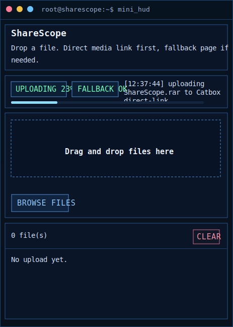

# ShareScope

ShareScope est un mini HUD desktop pour envoyer un fichier en quelques secondes et recuperer un lien partageable tout de suite.

L'objectif est simple :
- ouvrir l'app
- glisser un fichier dans la zone centrale
- attendre la fin de l'upload
- copier le lien et l'envoyer a ses amis

L'app est pensee pour les usages rapides, notamment quand un fichier ou une video est trop lourd pour etre envoye directement sur Discord.

## Apercu



## Fonctionnalites

- petit HUD compact, non redimensionnable, avec barre personnalisee
- drag and drop direct dans la fenetre
- bouton `Browse files` pour choisir un ou plusieurs fichiers
- historique local des fichiers envoyes
- bouton `Copy` pour copier instantanement le lien
- bouton `Open` pour ouvrir le lien dans le navigateur
- tooltip au survol avec taille, date de creation et expiration
- barre de progression visible pendant l'upload
- copie rapide du dernier lien genere
- persistance locale de l'historique entre les lancements

## Comment ca marche

ShareScope essaye d'abord d'obtenir un lien media direct pour les petits fichiers. Si ce mode n'est pas possible pour le fichier envoye, l'app bascule automatiquement sur un mode de partage plus large, afin de conserver un lien utilisable meme pour des fichiers plus gros.

En pratique :
- petits fichiers : meilleur cas, lien direct plus adapte aux medias
- fichiers plus gros : lien de partage classique

L'application choisit automatiquement le meilleur chemin disponible. Tu n'as rien a configurer pour l'usage normal.

## Utilisation

1. Lance `ShareScope.exe` ou `python app.py`.
2. Glisse un ou plusieurs fichiers dans la zone `Drag and drop files here`.
3. Attends la fin de l'upload.
4. Clique sur `Copy` pour recuperer le lien.
5. Envoie ce lien a tes amis.

Tu peux aussi :
- utiliser `Browse files` si tu ne veux pas faire de drag and drop
- cliquer sur `Open` pour verifier le lien dans ton navigateur
- cliquer sur `Clear` pour vider l'historique local affiche dans le HUD

## Historique

Chaque element de l'historique conserve localement :
- le nom du fichier
- le type de lien
- la taille
- la date de creation
- la date d'expiration estimee

Actions disponibles :
- `Copy` : copie le lien dans le presse-papiers
- `Open` : ouvre le lien

Au survol d'une ligne, le tooltip affiche un resume plus detaille dans le meme style visuel que le HUD.

## Cas d'usage

- partager rapidement un fichier avec un ami
- envoyer une video trop lourde pour Discord
- recuperer un lien en 2 clics sans ouvrir une grosse interface web
- garder sous la main un petit historique des derniers envois

## Limites

- l'app depend d'un acces reseau fonctionnel
- la vitesse d'upload depend de ta connexion
- selon le type de lien obtenu, la preview media dans Discord peut varier
- pour les tres gros fichiers, l'app peut passer par un mode de partage moins adapte aux previews directes
- l'historique est local au PC et au dossier utilisateur courant

## Installation

Installe les dependances :

```powershell
python -m pip install -r requirements.txt
```

## Lancement

Depuis le code source :

```powershell
python app.py
```

Ou via le lanceur Windows :

```powershell
launch_hud.bat
```

## Distribution

Une version compilee Windows peut etre distribuee sous forme d'executable unique.

Pour un utilisateur final, le flux reste le meme :
- ouvrir l'app
- glisser un fichier
- copier le lien

## Notes

- ShareScope est concu pour aller vite, pas pour remplacer un gros gestionnaire de cloud
- le HUD privilegie la rapidite, la lisibilite et un minimum de clics
- si un lien ne convient pas a un usage media donne, il reste partageable comme lien standard
